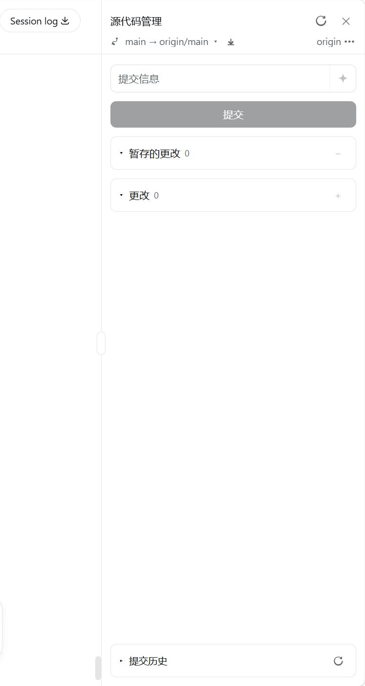
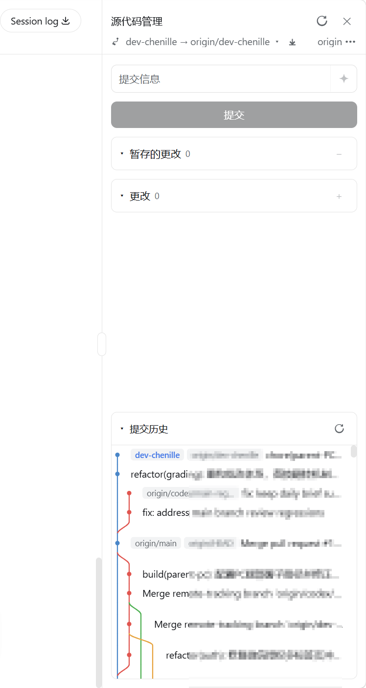

# @mojiexuan/dsh-git

一个为 [DeepSeek Harness](https://github.com/deepseek-ai/deepseek-harness) 打造的、类似 VS Code 的 **Git 源代码管理面板**插件（bundle）。在浏览器里提供仓库初始化、逐文件暂存、提交/推送/发布/拉取、分支与远程管理、AI 提交信息、以及提交历史图。

> English docs: [README.md](../README.md)

## 特性

- **可开关面板**：侧栏底部「设置」上方的入口打开/关闭面板。
- **仓库检测与初始化**：非仓库工作区显示一键「初始化 Git 仓库」（`git init -b main`）。
- **逐文件暂存**：可折叠的「暂存的更改 / 更改」列表，每行 `+`/`−`，另有「全部暂存 / 全部取消暂存」。
- **按 git 语义切换的按钮**：有未提交改动显示「提交」（未暂存时自动全部暂存）；分支已跟踪远程且领先时显示「推送」；分支无上游但有本地提交时显示「发布分支」。
- **拉取**：一键从所有远程拉取所有分支最新代码（`git fetch --all --prune`）；仅在配置了远程时显示。
- **分支管理**：列表 / 切换 / 创建 / 删除（带确认）。
- **远程管理**：显示 / 添加 / 删除 origin 远程（带确认）。
- **AI 提交信息**：流式生成 Conventional Commits 信息，基于暂存/工作区 diff 调用 harness LLM（默认中文输出）。
- **提交历史图**：所有分支 + 远程的 SVG 车道图（车道拓扑在前端计算，圆角曲线、柔和配色），默认展开在面板底部、占面板一半高度，长历史虚拟滚动 + 滚动到底分页加载，点击提交内联展开改动文件，悬浮显示提交信息 / 作者 / 日期 / hash（可复制完整 hash）。
- **自动刷新**：每 2.5 秒轮询 `git status`，面板外的编辑、提交、推送都能自动同步。
- **自动更新**：首次打开面板时静默检测 npm registry 是否有新版本；有新版本时，侧栏入口显示更新角标，面板顶部显示「点击立即更新」，更新后提示重启。
- **多语言**：中英双语界面。
- **跨平台**：Windows / macOS / Linux；git 以无约束方式运行，原生 TLS 与凭证助手在各平台都可用。

## 截图

| 源代码管理面板 | 提交历史 |
| --- | --- |
|  |  |

## 安装

```sh
dsh plugin --profile web add @mojiexuan/dsh-git
```

然后启动 `dsh web`。

## 卸载 / 更新

```sh
# 卸载（正式发布版与本地 link 版命令相同）
dsh plugin --profile web remove @mojiexuan/dsh-git

# 更新到最新发布版
dsh plugin --profile web update @mojiexuan/dsh-git
```

本地 link 开发（`dsh plugin --profile web add .`）无需单独的更新命令：改完代码 `npm run build` 后，完全重启 `dsh web`（host bundle）并刷新浏览器（client bundle）即可。

## 本地构建

```sh
npm install
npm run build       # 产出 lib/index.js（host）与 lib/client.js（client）
npm run typecheck
```

## 配置

可在 profile 的 `cordis.patch.yml` 中覆盖（均可选）：

```yaml
- id: git
  config:
    maxDiffChars: 4000     # 交给模型的 diff 长度上限（默认 4000）
    maxLogEntries: 2000    # 提交历史图每页加载的最大提交数（默认 2000；滚动到底继续加载）
    provider: deepseek     # 可选，固定 provider（缺省用部署默认模型）
    model: deepseek-chat   # 可选，固定 model
    reasoningEffort: off   # 'off'（默认）关闭思考；'high'/'max'/'default' 透传
    registryUrl: https://registry.npmjs.org  # 可选，更新检测所用的 npm registry 基址（默认 npmjs.org）
```

## 结构

```
src/
├── shared/rpc.ts             # 端点名 + DTO（双端共用，防止漂移）
├── host/                     # Node 半体
│   ├── index.ts              # git/* RPC 端点（仅 loopback）
│   ├── git.ts                # ctx.shell 封装 git；路径/消息走 stdin（杜绝 shell 注入）
│   ├── commit-message.ts     # diff 截断 + ctx.llm.stream 生成
│   └── update.ts             # 自更新：npm 版本检测 + dsh plugin update 执行器
└── client/                   # 浏览器半体
    ├── index.tsx             # 槽位注册 + RPC + 语言字典
    ├── GitPanel.tsx          # 源代码管理面板 UI
    ├── CommitGraph.tsx       # 提交历史图（分页 + 虚拟滚动）
    ├── graph.ts              # 前端车道/拓扑计算
    ├── BranchMenu.tsx        # 分支下拉
    ├── GitToggleButton.tsx   # 侧栏底部开关
    ├── rpc.ts                # 类型化 RPC 封装
    ├── locale.ts             # 中英文字典
    ├── fileIcons.tsx         # 文件类型图标
    ├── icons.tsx             # 图标集
    └── styles.ts             # 面板样式
```

## 安全边界

- 所有 `git/*` 端点以 `authority: 'loopback'` 注册，仅接受本机（127.0.0.1）请求。
- 用户数据绝不拼进命令字符串——消息经 `git commit -F -`、路径经 `--pathspec-from-file=-`，分支/远程名与 URL 用安全字符集校验。

## 发布

```sh
npm publish
```

给 GitHub 仓库打上 [`dsh-plugin`](https://github.com/topics/dsh-plugin) topic。

## 许可证

MIT
